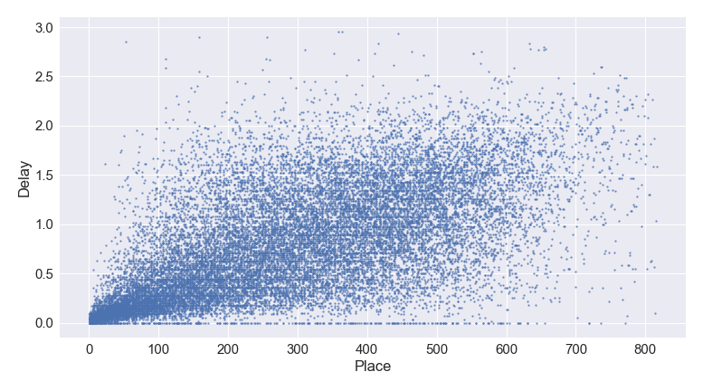
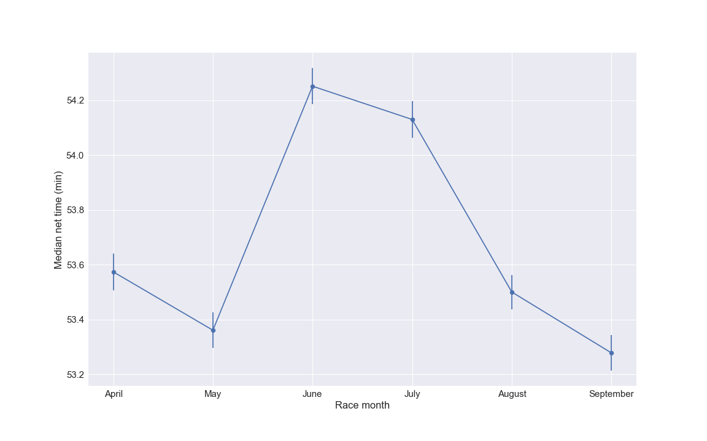

# regents-races

A fun little exercise to analyse 10k running races in Regent's park.

## Contents

There are three jupyter notebooks that deal with getting the data, cleaning the data and finally analysing the data.

* [Get the data](scrape_data.ipynb) Here we scrape the data from the website and save it into csv format for each individual race

* [Merge the data](merge_data.ipynb) For the analysis, it is easier to work with one dataframe that contains all the information, so I merged the data.

* [Race analysis](race_analysis.ipynb) This is the fun part where we look at the data!

## Some insights from the analysis

### 10 k finish times

The easiest analysis is to plot the distribution of finish times:

If we separate the data by gender, we can see a clear split of male and female runners:

### Where to stand at the start of the race

Ideally, at the start of the race, runners would line up from the start line in the order that they finish the race. This would get rid of faster runners overtaking slower runners (although in this race there are three laps, so it gets more complicated). By plotting the time delay upon crossing the start line against final place, we can quantify how well this works in practice:

Up to the first 100 runners, one can see a linear trend emerging, which is gradually blurred out. This shows that the fastest runners line up closest to the start line, but is then less strictly followed. While there is a clear signal in the data, the runners do not line up too well.

We also see that there is a line of data point at 0 min delay extending to high places, i.e. starting right in front. These runners seem to have started right at the front, but did not finish there.

### Seasonality effects: when to obtain best finish time

It is of interest to explore which races are the fastest. There are six 10k races each year in Regent's park, from April to September. The figure below shows the median finish over years 2011 to 2017 as a funciton of race month:

We can clearly see the slowest races are in June/ July, whereas September is the fastest race.

These seasonality effects likely emerge from different temperatures of the races as well as cumulative training at the end of the running season.

Hence the recommendation for running the fastest 10k is to do it in September!