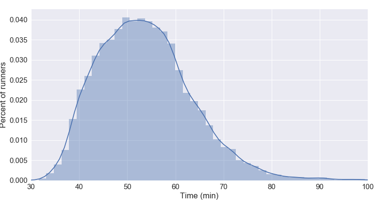
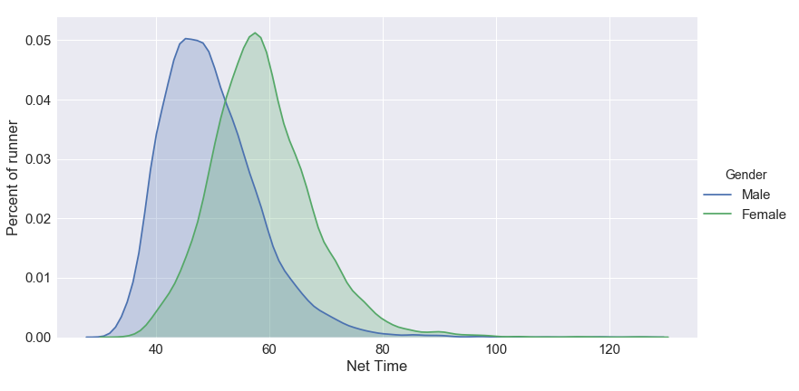

# regents-races

A fun little exercise to analyse 10k running races in Regent's park.

## Contents

There are three jupyter notebooks that deal with getting the data, cleaning the data and finally analysing the data.

* [Get the data](scrape_data.ipynb) Here we scrape the data from the website and save it into csv format for each individual race

* [Merge the data](merge_data.ipynb) For the analysis, it is easier to work with one dataframe that contains all the information, so I merged the data.

* [Race analysis](race_analysis.ipynb) This is the fun part where we look at the data!

## Highlights from analysis

### 10 k Finish time

### Seasonality: when to obtain best finish time

